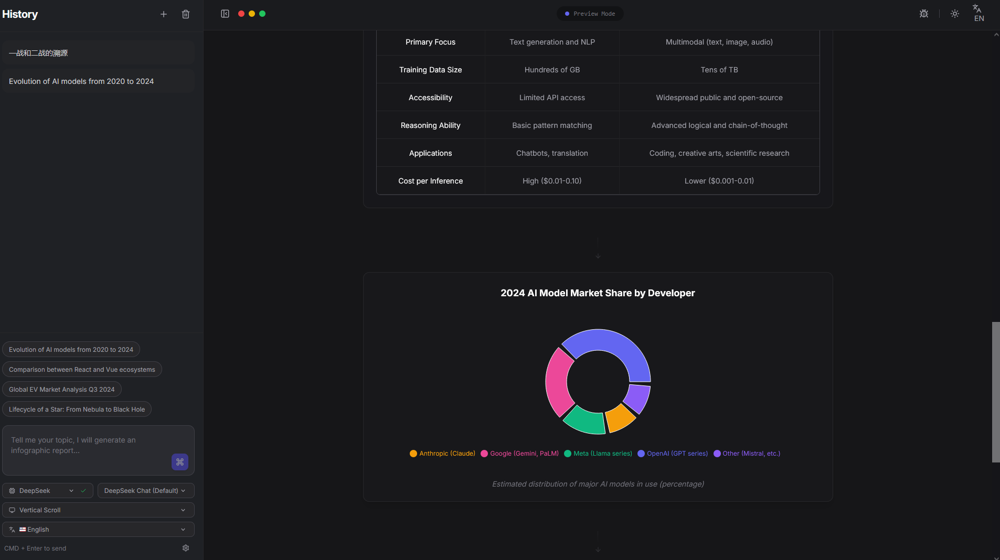

<div align="center">
  <h1>InfoGraphix AI</h1>
  <p>Transform research topics into beautiful infographic reports powered by AI</p>
</div>

## Demo



[📹 Watch Demo Video](https://github.com/youyouhe/InfoGraphix-AI/releases/tag/v1.0.0-demo)

## Features

- **Multi-Provider LLM Support**: Gemini, DeepSeek, OpenRouter, OpenAI
- **Streaming JSON Responses**: Real-time content updates as AI generates
- **Bilingual Interface**: English and Chinese UI with toggle
- **8-Language Output**: Generate infographics in English, Chinese, Japanese, Korean, Spanish, French, German, or Portuguese
- **Multiple Display Modes**: Vertical scroll, horizontal scroll, and pagination
- **High-Res PNG Export**: Export pages individually or all at once
- **Dark Mode**: Built-in theme switching
- **Search Grounding**: Gemini with Google Search integration

## Prerequisites

- Node.js 18+
- npm or yarn

## Installation

1. Clone the repository:
   ```bash
   git clone https://github.com/youyouhe/InfoGraphix-AI.git
   cd InfoGraphix-AI
   ```

2. Install dependencies:
   ```bash
   npm install
   ```

3. Create `.env.local` file:
   ```bash
   # Required (default provider)
   GEMINI_API_KEY=your_gemini_api_key_here

   # Optional providers
   DEEPSEEK_API_KEY=your_deepseek_key
   OPENROUTER_API_KEY=your_openrouter_key
   OPENAI_API_KEY=your_openai_key

   # Default provider (gemini, deepseek, openrouter, openai)
   DEFAULT_PROVIDER=gemini
   ```

## Usage

Start the development server:
```bash
npm run dev
```

Open [http://localhost:3000](http://localhost:3000) in your browser.

## Build for Production

```bash
npm run build
```

Preview the production build:
```bash
npm run preview
```

## Project Structure

```
infographix-ai/
├── components/          # React components
│   ├── Sidebar.tsx
│   ├── SettingsModal.tsx
│   └── Visuals.tsx      # Section rendering components
├── i18n/               # Internationalization
│   ├── locales.ts      # Language definitions
│   └── translations.ts # Translation strings
├── services/
│   ├── factory.ts      # Provider factory
│   ├── providers/      # LLM provider implementations
│   ├── prompts/        # System prompts & schemas
│   ├── export/         # PNG export utilities
│   └── registry/       # Section type registry
├── App.tsx             # Main application
└── types.ts            # TypeScript types
```

## API Keys

Get API keys from:
- **Gemini**: [https://makersuite.google.com/app/apikey](https://makersuite.google.com/app/apikey)
- **DeepSeek**: [https://platform.deepseek.com/api_keys](https://platform.deepseek.com/api_keys)
- **OpenRouter**: [https://openrouter.ai/keys](https://openrouter.ai/keys)
- **OpenAI**: [https://platform.openai.com/api-keys](https://platform.openai.com/api-keys)

## License

MIT License - see LICENSE file for details
